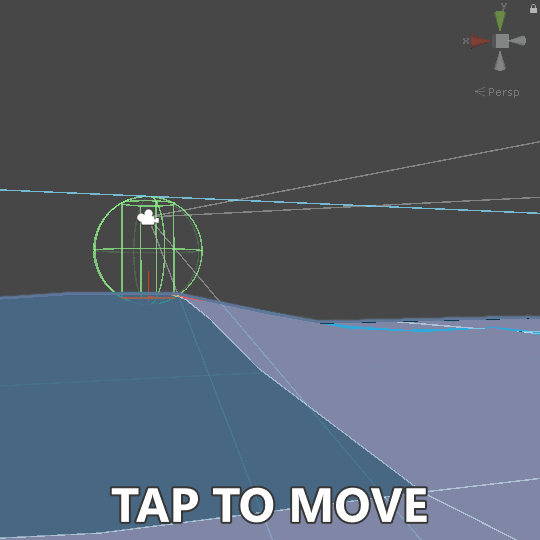

# Player navigator using a navigation mesh

<p align="center">

  

</p>

This article will take you through the process of making a player navigation scripts that allows you to move a character across Unity's navigation surface using a direction as input device. This allows you to generate a navigation mesh beforehand that the character can not leave and avoids the necessity of doing physics calculations and putting up invisible barriers. The downside is that a player can not move off or across mesh links easily without creating a custom system for it, think of jumping over obstacles. Luckily not all games require this and so this method might be useful for your game. I like this method because it can be used with both stick input as well as pointer input, which makes it great for mobile games.

> I highly recommend you start by add Unity's [NavMeshComponents](https://github.com/Unity-Technologies/NavMeshComponents) to your project, which allow you to easily create a `NavMeshSurface`.

We start the writing our system by importing the `UnityEngine`, and `UnityEngine.AI` namespaces as well as require the `NavMeshAgent` and `Rigidbody` scripts to be attached to the game object. Requiring the components makes sure they can always be retrieved and are automatically added the game object when added via the inspector window.

```C#
using UnityEngine;
using UnityEngine.AI;

namespace Player {
  [RequireComponent(typeof(NavMeshAgent), typeof(Rigidbody))]
  public class PlayerNavigator : MonoBehaviour {
    // [...] More code.
  }
}
```

Using the inspector window we want to make sure the following options are set of the `Rigidbody`, the gravity is disabled, kinematic is enabled, interpolate set to interpolate, and under constraints we want to freeze the rotation on all axes. If it is important that the character still hits triggers then you might want to set the collision detection to continues speculative. As for the `NavMeshAgent`, make sure the acceleration is set significantly higher than the speed otherwise the agent will overshoot its destination.

Now we have our class setup we can retrieve and setup the variables we already know we need using the `Awake` functions. Besides the components attached to the game object we also need to what the forward direction is relative the camera. Therefore lets add a variable for that which in our case is a component of a child object.

```C#
#region Variables
  private Camera _camera = default;
  private NavMeshAgent _navigationAgent = default;
  private RigidBody _rigidBody = default;
#endregion

#region MonoBehaviour functions
  private void Awake() {
    _camera = GetComponentInChildren<Camera>();
    _navigationAgent = GetComponent<NavMeshAgent>();
    _navigationAgent.updateRotation = false;
    _rigidbody = GetComponent<Rigidbody>();
  }
#endregion
```

> I have disabled the updateRotation since I am using it as a simple player controller for a game with a first person perspective. Therefore the camera is a child object of this game object and if it were enabled the camera will turn with direction the navigation agent is going and create a nauseating and confusion experience.

When the character is activated we want to make sure it is placed on the navigation surface, because if it slightly offset it will not work. To do this we use the `Navigation.SamplePosition` method we give it a desired location, a maximum distance from it, output data, and an area mask.

```C#
#region Variables
  // [...] Previously written code.
  
  [SerializeField] [Tooltip("The name of the walkable area.")]
  private string _areaMaskName = "Walkable";
  
  private int _areaMask = default;
  
  private NavMeshHit _navigationHitTemp = default;
#endregion

#region MonoBehaviour functions
  private void Awake() {
    // [...] Previously written code.
    
    _areaMask = 1 << NavMesh.GetAreaFromName(_areaMaskName);
  }
  
  private void OnEnable() {
    // Place object on navigation surface.
    if (NavMesh.SamplePosition(transform.position, out _navigationHitTemp, 16f, _areaMask)) {
      _navigationAgent.Warp(_navigationHitTemp.position);
    }
  }
#endregion
```

Next up lets add a destination and a stop functions. These allow us to easily control the character by giving it a specific point after which it will attempt to find the closest. This is how the navigation system is normally used and is great for pointer input.

```C#
#region Variables
  // [...] Previously written code.
  
  [SerializeField] [Tooltip("The layers of the raycastable and walkable surface.")]
  private LayerMask _layerMask = default;
  
  private Vector2? _input = default;
#endregion

#region Public functions
  /// <summary> Stop the agent from moving.</summary>
  public void Stop() {
    _input = default;
    _navigationAgent.SetDestination(transform.position);
  }

  /// <summary>Set the agents destination</summary>
  /// <param name="_transform">The transform of the game object hit with the raycast.</param>
  /// <param name="_position">The raycast hit position.</param>
  public void SetDestination(Transform _transform, Vector3 _position) {
    // Check if the layer of the game object is valid.
    if (!_layerMask.Contains(_transform.gameObject.layer)) {
      return;
    }
    
    // Sample the nearest position.
    if (NavMesh.SamplePosition(_position, out _navigationHitTemp, _navigationAgent.stoppingDistance * 64, _areaMask)) {
      _input = default;
      _navigationAgent.SetDestination(_navigationHitTemp.position);
    }
  }
#endregion

#region Private functions
  /// <summary>Check whether the layer is contained in the mask.</summary>
  /// <param name="_mask">The layer mask.</param>
  /// <param name="_layer">The index of the layer.</param>
  /// <returns>True if layer is contained in mask.</returns>
  private static bool Contains(this LayerMask _layerMask, int _layer) {
    return _layerMask == 1 << _layer;
  }
#endregion
```

> An input variables has been added as well, this will be used next when adding the move functions. Right now we just want to reset it if we set a destination for the character to travel to.

Now we want to get into the real deal and add the move functions. These methods will allow us provide the component with input. The input will be stored in variable from earlier so we can use it an update method later.

```C#
#region Public functions
  /// <summary>Set the move vector.</summary>
  /// <param name="_input">Input vector.</param>
  private void Move(Vector2 _input) {
    // Override the current input.
    this._input = _input;
  }
  /// <summary>Reset values when moving is done.</summary>
  private void MoveCanceled() {
    // Reset input.
    _input = default;
  }
#endregion
```

Now that we set the input value we need to use it. We do this in the `FixedUpdate` method since we are move an object that interacts with other physics objects, in our case only triggers important notheless. 

```C#
#region Variables
  // [...] Previously written code.
  
  [SerializeField] [Range(0f, 8f)] [Tooltip("Additional movement speed when using the Move function.")]
  public float _speed = 2f;
  
  private float _slopeMaxHeight = 0;
  
  private Vector3 _offsetPositionTemp = default;
#endregion

#region MonoBehaviour functions
  private void Awake() {
      // [...] Previously written code.
      
      _slopeMaxHeight = Mathf.Sin(Mathf.Deg2Rad * NavMesh.GetSettingsByID(_navigationAgent.agentTypeID).agentSlope) * 2f;
  }
  
  // [...] Previously written code.
  
  private void FixedUpdate() {
    // Return early if there is no input value set.
    if (!_input.HasValue) {
      return;
    }
    
    // Calculate the offset position.
    _offsetPositionTemp = (_navigationAgent.speed * _speed * Time.fixedDeltaTime) * (CalculateRotationY(_camera.transform.rotation) * new Vector3(_input.Value.x, 0, _input.Value.y));
    
    // Sample the nearest position, return early if none found.
    if (!NavMesh.SamplePosition(transform.position + _offsetPositionTemp, out _navigationHitTemp, _offsetPositionTemp.magnitude, _areaMask)) {
      return;
    }
    
    // Check if position is out of range in y axis.
    if (Mathf.Abs(_navigationHitTemp.position.y - transform.position.y) > _slopeMaxHeight * Vector2.Distance(transform.position, _navigationHitTemp.position)) {
      return;
    }
    
    // Apply new position to rigidbody.
    _rigidbody.MovePosition(_navigationHitTemp.position);
    _navigationAgent.SetDestination(transform.position);
  }
#endregion

#region Private functions
  // [...] Previously written code.
  
  /// <summary>Get the rotation on y-axis of quaternion.</summary>
  /// <param name="quaternion">The rotation.</param>
  /// <returns>The angle offset on the y-axis.</returns>
  private static Quaternion CalculateRotationY(Quaternion quaternion) {
    float theta = Mathf.Atan2(quaternion.y, quaternion.w);
    return new Quaternion(0, Mathf.Sin(theta), 0, Mathf.Cos(theta));
  }
#endregion
```

That has been it, now all you need to do is link up the public functions to your input system and away your character can go. The final script should look like this:

```C#
using UnityEngine;
using UnityEngine.AI;

namespace Player {
  [RequireComponent(typeof(NavMeshAgent), typeof(Rigidbody))]
  public class PlayerNavigator : MonoBehaviour {
    #region Variables
      [SerializeField] [Range(0f, 8f)] [Tooltip("Additional movement speed when using the Move function.")]
      public float _speed = 2f;
      [SerializeField] [Tooltip("The name of the walkable area.")]
      private string _areaMaskName = "Walkable";
      [SerializeField] [Tooltip("The layers of the raycastable and walkable surface.")]
      private LayerMask _layerMask = default;
      
      private Camera _camera = default;
      private NavMeshAgent _navigationAgent = default;
      private Rigidbody _rigidbody = default;
      
      private int _areaMask = default;
      private float _slopeMaxHeight = 0;
      private Vector2? _input = default;
      
      private NavMeshHit _navigationHitTemp = default;
      private Vector3 _offsetPositionTemp = default;
    #endregion
    
    #region MonoBehaviour functions
      private void Awake() {
        _camera = GetComponentInChildren<Camera>();
        _navigationAgent = GetComponent<NavMeshAgent>();
        _navigationAgent.updateRotation = false;
        _rigidbody = GetComponent<Rigidbody>();
        
        _areaMask = 1 << NavMesh.GetAreaFromName(_areaMaskName);
        _slopeMaxHeight = Mathf.Sin(Mathf.Deg2Rad * NavMesh.GetSettingsByID(_navigationAgent.agentTypeID).agentSlope) * 2f;
      }
      
      private void OnEnable() {
        // Place object on navigation surface.
        if (NavMesh.SamplePosition(transform.position, out _navigationHitTemp, 16f, _areaMask)) {
          _navigationAgent.Warp(_navigationHitTemp.position);
        }
      }
      
      private void FixedUpdate() {
        // Return early if there is no input value set.
        if (!_input.HasValue) {
          return;
        }
        
        // Calculate the offset position.
        _offsetPositionTemp = (_navigationAgent.speed * _speed * Time.fixedDeltaTime) * (CalculateRotationY(_camera.transform.rotation) * new Vector3(_input.Value.x, 0, _input.Value.y));
        
        // Sample the nearest position, return early if none found.
        if (!NavMesh.SamplePosition(transform.position + _offsetPositionTemp, out _navigationHitTemp, _offsetPositionTemp.magnitude, _areaMask)) {
          return;
        }
        
        // Check if position is out of range in y axis.
        if (Mathf.Abs(_navigationHitTemp.position.y - transform.position.y) > _slopeMaxHeight * Vector2.Distance(transform.position, _navigationHitTemp.position)) {
          return;
        }
        
        // Apply new position to rigidbody and navigation agent.
        _rigidbody.MovePosition(_navigationHitTemp.position);
        _navigationAgent.SetDestination(transform.position);
      }
    #endregion
    
    #region Public functions
      /// <summary> Stop the agent from moving.</summary>
      public void Stop() {
        // Reset position.
        _input = default;
        _navigationAgent.SetDestination(transform.position);
      }
      
      /// <summary>Set the agents destination</summary>
      /// <param name="_transform">The transform of the game object hit with the raycast.</param>
      /// <param name="_position">The raycast hit position.</param>
      public void SetDestination(Transform _transform, Vector3 _position) {
        // Check if the layer of the game object is valid.
        if (!_layerMask.Contains(_transform.gameObject.layer)) {
          return;
        }
        
        // Sample the nearest position.
        if (NavMesh.SamplePosition(_position, out _navigationHitTemp, _navigationAgent.stoppingDistance * 64, _areaMask)) {
          _input = default;
          _navigationAgent.SetDestination(_navigationHitTemp.position);
        }
      }
      
      /// <summary>Set the move vector.</summary>
      /// <param name="_input">Input vector.</param>
      private void Move(Vector2 _input) {
        // Override the current input.
        this._input = _input;
      }
      /// <summary>Reset values when moving is done.</summary>
      private void MoveCanceled() {
        // Reset input.
        _input = default;
      }
    #endregion
    
    #region Private functions
      /// <summary>Check whether the layer is contained in the mask.</summary>
      /// <param name="_mask">The layer mask.</param>
      /// <param name="_layer">The index of the layer.</param>
      /// <returns>True if layer is contained in mask.</returns>
      private static bool Contains(this LayerMask _mask, int _layer) {
        return (_mask & 1 << _layer) > 0;
      }
      
      /// <summary>Get the rotation on y-axis of quaternion.</summary>
      /// <param name="quaternion">The rotation.</param>
      /// <returns>The angle offset on the y-axis.</returns>
      private static Quaternion CalculateRotationY(Quaternion quaternion) {
        float theta = Mathf.Atan2(quaternion.y, quaternion.w);
        return new Quaternion(0, Mathf.Sin(theta), 0, Mathf.Cos(theta));
      }
    #endregion
  }
}
```

> A mirror of the final result can be found here [`Player/PlayerNavigator.cs`](https://github.com/RedKenrok/Unity-Scripts/blob/master/Player/PlayerNavigator.cs).